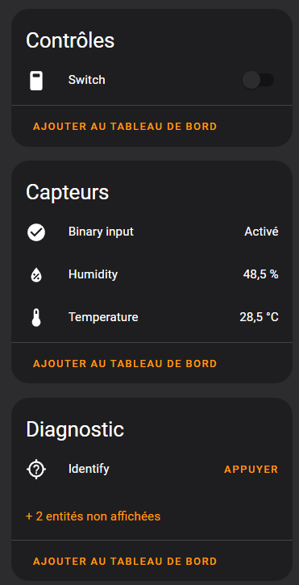

# ESP32-H2 Zigbee CCT Device

This project is a Custom color temperature (CCT) Zigbee device based on the ESP32-H2 / ESP32-C6

## Features

- [x] CCT light
- [x] Level control
- [ ] Temperature sensor

> ## Clusters
> * Basic_cluster
> * Identify_cluster
> * On_off_cluster
> * Temperature_meas_cluster
> * Level_cluster
> * Color_cluster

## Hardware

- [ESP32-H2](https://www.espressif.com/en/products/socs/esp32-h2)
- [ESP32-C6](https://www.espressif.com/en/products/socs/esp32-c6)

## GPIO

| GPIO   | Function              |
| ------ | --------------------- |
| ~~GPIO12~~ | ~~Binary input (Button)~~ |
| GPIO3 | WARM LED PWM output |
| GPIO5 | COLD LED PWM output |
