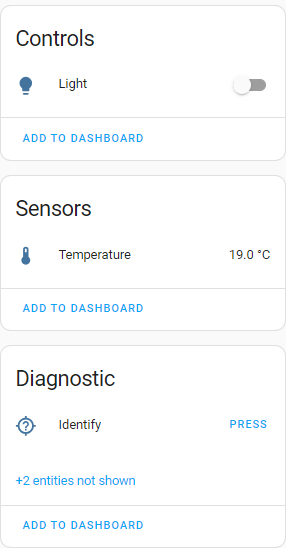

# ESP32-H2 Zigbee CCT Device

This project is a Custom color temperature (CCT) Zigbee device based on the ESP32-H2 / ESP32-C6
with property saving (color temp and power level) after 5 seconds without changes

## Features

- [x] CCT light
- [x] Level control
- [x] Property saving
- [ ] Binary input
- [x] Temperature sensor

 ## Clusters

 * Basic_cluster
 * Identify_cluster
 * On_off_cluster
 * Temperature_meas_cluster
   - Esp32-h2 built-in temperature sensor used
 * Level_cluster
 * Color_cluster
   - Color temperature only

--------

-------
## Hardware

- [ESP32-H2](https://www.espressif.com/en/products/socs/esp32-h2)  or [ESP32-C6](https://www.espressif.com/en/products/socs/esp32-c6)

## GPIO

| GPIO   | Function              |
| ------ | --------------------- |
| ~~GPIO12~~ | ~~1-Wire sensor (Dallas)~~ |
| ~~GPIO8~~ | ~~Binary input (Button)~~ |
| GPIO3 | WARM LED PWM output |
| GPIO5 | COLD LED PWM output |
